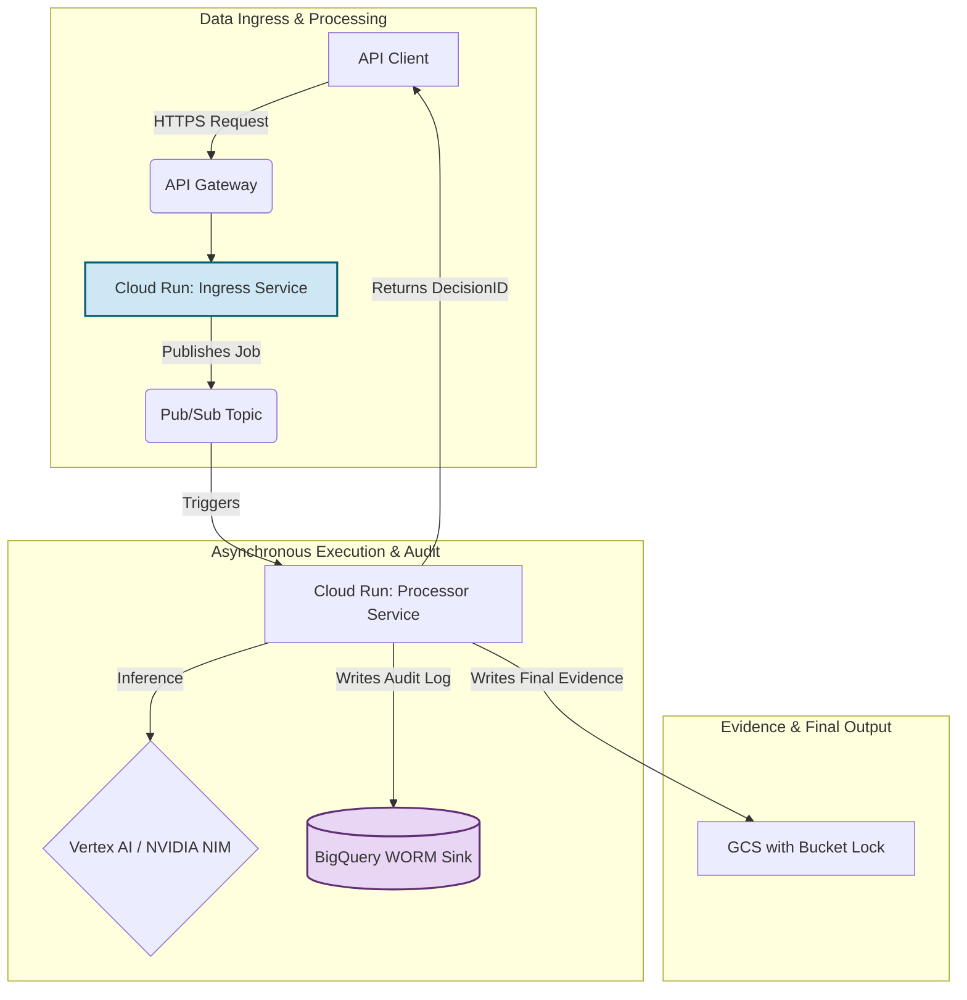
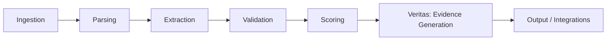
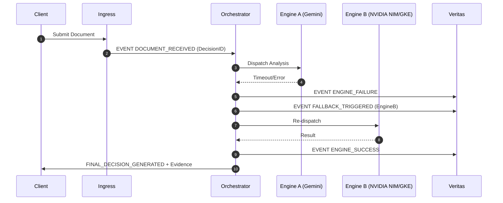
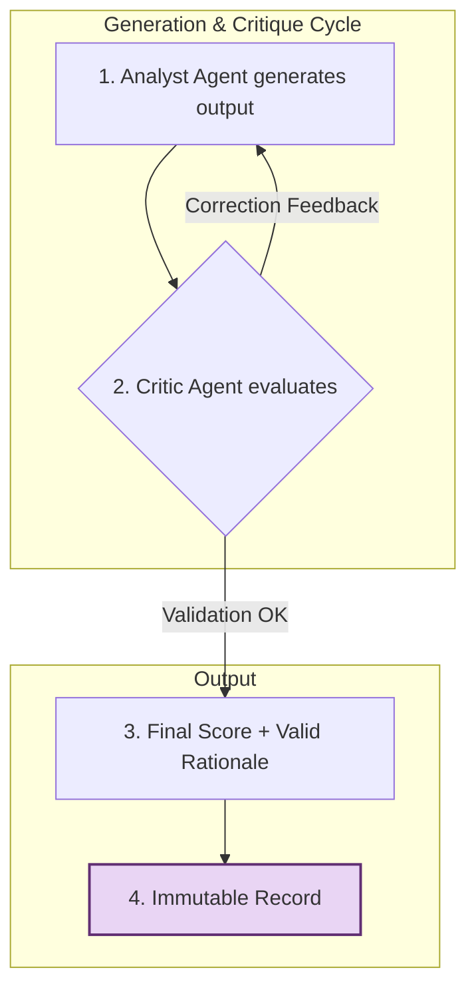
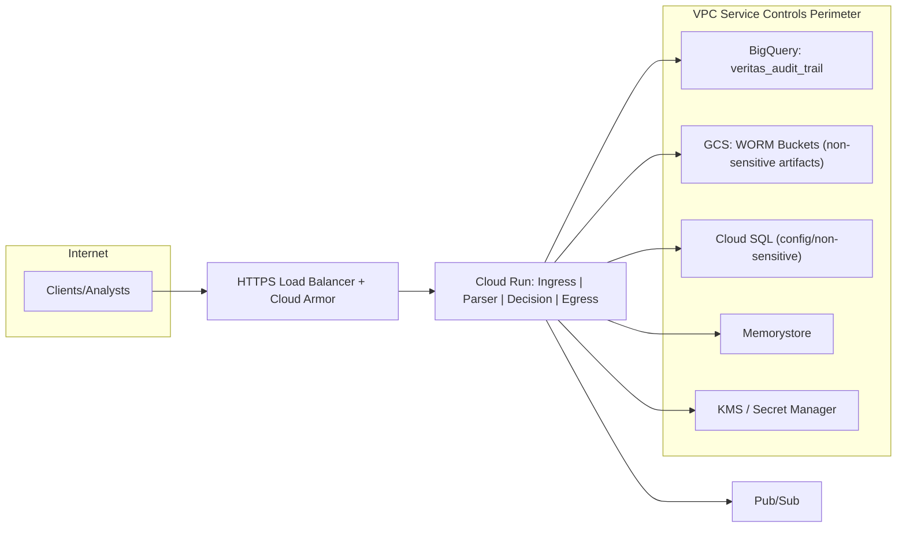
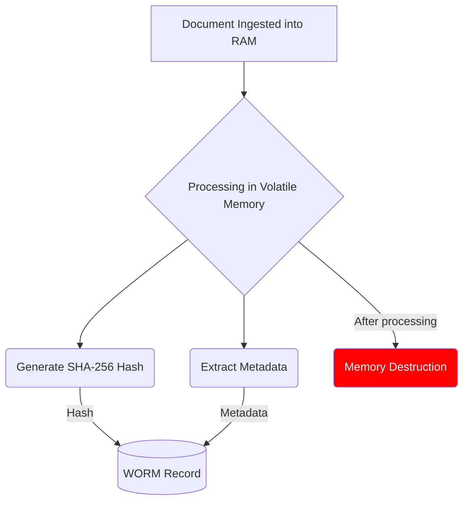
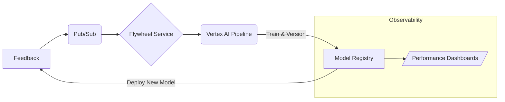

<p align="center">
  <a href="https://ibb.co/KpNq85zS">
    
  </a>
</p>

<h1 align="center">FoundLab Veritas: Auditable Trust Infrastructure</h1>
<h3 align="center">Transforming regulatory risk into a defensible, computational asset.</h3>

<div align="center">
  
  
  
  
  <a href="https://github.com/FoundLab-org/veritas/actions/workflows/simulation_check.yml">
    
  </a>
</div>
<div align="center" style="margin-top: 4px;">
  
  
  
</div>

---

## Table of Contents
- [1. Institutional Thesis](#1-institutional-thesis)
- [2. Architectural Primitives](#2-architectural-primitives)
- [3. System Architecture](#3-system-architecture)
- [4. Live-Fire Case Study: The NVIDIA SSO Incident](#4-live-fire-case-study-the-nvidia-sso-incident)
- [5. Strategic Implications for NVIDIA](#5-strategic-implications-for-nvidia)
- [6. Technical Appendices](#6-technical-appendices)
- [7. Compliance-as-Infrastructure](#7-compliance-as-infrastructure)
- [8. Technical Due Diligence Dossier](#8-technical-due-diligence-dossier)
- [9. License & Disclaimer](#9-license--disclaimer)

---

## 1. Institutional Thesis

FoundLab's central thesis is that the solution to the institutional trilemma—innovation speed vs. systemic risk vs. regulatory complexity—lies in a paradigm shift: **transforming trust from an operational outcome into a fundamental, programmable component of the infrastructure.**

We do not build better applications on risky foundations; we create a new foundation that eliminates risk at its source. This repository is the blueprint and live demonstration of this new category: **Auditable Trust Infrastructure as a Service.**

---

## 2. Architectural Primitives

The platform is built on three interdependent pillars whose synergistic interaction resolves the strategic trilemma of speed, risk, and compliance.

<details>
<summary><strong>Pillar I: Radical Security (Zero-Persistence)</strong></summary>

> This pillar is the practical implementation of the Zero-Trust principle. By mandating that sensitive client data is **never stored on disk**, the "zero-persistence" paradigm fundamentally eradicates the most common and dangerous risk class: the breach of data at rest. All processing occurs exclusively in volatile memory within ephemeral containers. This is not just a policy; it is an architectural enforcement that provides a cryptographic "Certificate of Destruction" for every transaction, aligning with NIST SP 800-88 Rev. 1 standards and directly addressing the data minimization principles of GDPR and LGPD.

</details>

<details>
<summary><strong>Pillar II: Absolute Auditability (Veritas Protocol)</strong></summary>

> The Veritas Protocol shifts the audit paradigm from "trust us" to "mathematically verify." For each decision cycle, the system generates an immutable and tamper-proof audit trail, sealed by a cryptographic **hash chain** and associated with a unique **DecisionID**. This creates a verifiable digital chain-of-custody for every action. The ledger is stored in a WORM (Write-Once, Read-Many) sink, such as Google BigQuery, protected by strict IAM controls and VPC Service Perimeters to prevent data exfiltration. Any attempt to alter a previous record would invalidate the entire subsequent chain, making fraud computationally detectable.

</details>

<details>
<summary><strong>Pillar III: Antifragile Intelligence</strong></summary>

> The platform orchestrates multiple AI engines (e.g., Google Gemini, NVIDIA NIMs) to automate complex analysis. The architecture is designed to be **antifragile**:
> - **Multi-Engine Orchestration:** An Engine Abstraction Layer (EAL) dynamically routes tasks to the best AI model, preventing vendor lock-in and ensuring resilience.
> - **Audited Fallback:** If a primary engine fails, the EAL automatically triggers a secondary engine, and the entire failure/recovery event is immutably recorded by the Veritas Protocol, turning operational failures into auditable events.
> - **Explainable AI (XAI) & Flywheel:** Every AI-driven decision is accompanied by a human-readable `Rationale`. This output, combined with human feedback, feeds a closed-loop MLOps pipeline (the "IA Flywheel") that continuously retrains and improves the models, creating a compounding competitive advantage in accuracy and reliability.

</details>

---

## 3. System Architecture

The Veritas Protocol operates on a serverless, event-driven architecture on Google Cloud, ensuring massive scalability, security, and cost-efficiency.



---

<details>
<summary><strong>Operational Excellence (SRE) & Antifragility</strong></summary>

> Our architecture is not merely resilient; it is designed to be **antifragile**, strengthening from stress and operational failures. We adopt Google's Site Reliability Engineering (SRE) principles to treat reliability as a software engineering problem.
> - **Service Level Objectives (SLOs):** We define clear SLOs for critical metrics like availability (e.g., 99.9%) and latency (e.g., p95 < 520ms).
> - **Error Budgets:** Our operational model is governed by Error Budgets. This allows teams to balance innovation with stability, consuming the budget for new releases and freezing changes when the budget is depleted.
> - **Audited Fallback:** As detailed in the Architectural Primitives, failures are not catastrophic events; they are auditable transactions. A primary engine failure triggers a secondary engine, and the entire sequence is immutably logged in the Veritas Protocol, providing a transparent and defensible record of the system's self-healing capabilities.

</details>

<details>
<summary><strong>The AI Flywheel: Compounding Intelligence</strong></summary>

> The platform is not static; it is a dynamic system that improves with every transaction. This continuous learning cycle, the **IA Flywheel**, is a strategic differentiator that creates a lasting competitive moat.
> - **Feedback Capture:** The system captures feedback from both automated flags (e.g., `low_confidence_score`) and human reviewers (e.g., `manual_override`, `score_adjustment`).
> - **Immutable Record:** Every feedback event is treated as a critical transaction and is immutably recorded in the Veritas Protocol, linked to the original `DecisionID`. This ensures that the model calibration process itself is fully auditable.
> - **Automated Retraining:** Feedback events trigger a serverless **Vertex AI Pipeline** that automatically retrains, evaluates, and versions the relevant AI model. The new model candidate is only promoted if its performance exceeds the current production model, with an audited rollback capability always available. This creates a proprietary data asset of decision-making that makes the platform smarter and more accurate with each use.

</details>

<details>
<summary><strong>Strategic Enabler: The Operational ROI Framework</strong></summary>

> Technology is only valuable if it generates a quantifiable return. The Veritas platform is designed to produce significant, measurable Operational Alpha by transforming high-cost, high-risk manual processes into low-cost, deterministic, and auditable computational workflows.
>
> Our engagement model includes a comprehensive ROI analysis based on the following framework:
> - **Variables:** `T_manual_hours`, `C_analyst_hr`, `N_cases_month`, `P_error_rate`, `C_error_cost`, `P_fraud_rate`, `C_fraud_cost`, `T_umbrella_min`, `License_USD_month`.
> - **Formulas:** We calculate `C_total_current_state` vs. `C_total_umbrella_state` to derive key metrics like **ROI**, **Payback Period**, and **Error Reduction Rate**.
> - **Output:** The result is a clear before-and-after analysis that quantifies the value of moving from a trust-based operational model to a mathematically verifiable one. For a typical use case, we project a >90% reduction in processing time and a significant decrease in costs associated with manual error and compliance remediation.

</details>

## 4. Live-Fire Case Study: The NVIDIA SSO Incident

This repository includes a self-contained, self-verifying simulation that replicates the October 2025 unauthorized SSO federation attempt. It is not a mock; it is a live execution of the core cryptographic logic and policy engine.

For a complete analysis, please see the full study case: [https://irelia0nerf.github.io/Studycase/](https://irelia0nerf.github.io/Studycase/)

### Step 1: Execute the Specification

Navigate to the simulation directory and run the script.

```bash
cd infracore_simulation
pip install -r ../requirements.txt
python main.py
```

### Step 2: Visualize the Cryptographic Proof

The script generates a raw cryptographic log (`veritas_audit_trail.jsonl`). To translate this proof into a human-readable report, run the visualization script:

```bash
python visualize_trail.py
```
This creates an `audit_report.html` file, providing a clear, visual representation of the immutable decision chain.

---

## 5. Strategic Implications for NVIDIA

Veritas is not merely a security tool; it is a **market enabler**. By integrating Veritas, NVIDIA can de-risk its AI ecosystem and unlock high-value enterprise verticals that are currently inaccessible due to regulatory constraints.

- **Unlock Regulated Markets:** Offer "Auditable AI" as a premium feature. Financial services, healthcare, and public sector clients can adopt NVIDIA's most powerful models with the guarantee of a mathematically verifiable compliance trail for every single inference, satisfying regulators like the SEC, BACEN, and HIPAA.
- **Create a Competitive Moat:** Differentiate the NVIDIA AI ecosystem from other cloud providers. While others offer raw performance, NVIDIA can offer **performance with proof**. An immutable, hardware-attested audit trail for AI operations would be a powerful and defensible market position.
- **De-risk the Supply Chain:** The very incident that prompted this report highlights the systemic risk in modern software supply chains. Veritas provides the mechanism to enforce policy and create auditable proof for any critical action within the NGC ecosystem, from user federation to container publishing.

---

## 6. Technical Appendices

<details>
<summary><strong>Appendix A: Canonical Contracts (JSON Schema)</strong></summary>

### A.1. Veritas Protocol Audit Log Entry
```json
{
  "$schema": "http://json-schema.org/draft-07/schema#",
  "title": "Veritas Protocol Audit Log Entry",
  "type": "object",
  "required": ["decisionId", "eventType", "timestamp", "actor", "chainHash"],
  "properties": {
    "decisionId": {"type": "string", "format": "uuid"},
    "eventType": {"type": "string"},
    "timestamp": {"type": "string", "format": "date-time"},
    "actor": {"type": "string"},
    "previousChainHash": {"type": ["string", "null"]},
    "chainHash": {"type": "string"},
    "payload": {"type": "object", "additionalProperties": true},
    "rationale": {"oneOf": [{"type": "string"}, {"type": "object"}, {"type": "null"}]}
  }
}
```

### A.2. Decision Output Example
```json
{
  "decisionId": "uuid",
  "score": {"value": 0.0, "scale": "0-1"},
  "explainableRationale": "string",
  "flags": ["string"],
  "evidenceUris": ["gs://..."],
  "veritasProof": {"chainHash": "...", "previous": "..."}
}
```
</details>

<details>
<summary><strong>Appendix C: Architectural Diagrams (Mermaid)</strong></summary>

### C.1. End-to-End Pipeline



### C.2. Audited Fallback Mechanism



### C.3. Critic-Loop Flow



### C.4. VPC Service Controls Perimeter



### C.5. Zero-Persistence Flow

*Ensures sensitive data is never persisted to disk, minimizing the attack surface.*



### C.6. AI Flywheel (Continuous Learning)

*The MLOps engine that ensures our system gets smarter with every interaction.*



</details>

<details>
<summary><strong>Appendix D: Veritas Chain Verification</strong></summary>

### D.1. Full Trail Query by DecisionID
```sql
-- BigQuery Standard SQL
SELECT * FROM `foundlab-core-460315.veritas.veritas_audit_trail`
WHERE decisionId = "UUID_TO_QUERY" ORDER BY timestamp;
```

### D.2. Local Chain Verification Script
This script provides client-side verification of an exported audit trail, proving its integrity.
```python
#!/usr/bin/env python3
import sys, json, hashlib

def verify_chain(path):
    prev_hash = None
    count = 0
    with open(path, "r", encoding="utf-8") as f:
        for line in f:
            rec = json.loads(line)
            
            # Verify chain link
            if prev_hash is None:
                assert rec["previousChainHash"] is None, "Genesis event has a previous hash"
            else:
                assert rec["previousChainHash"] == prev_hash, "Hash chain broken"

            # Recompute hash to verify integrity
            event_data = {
                "decisionId": rec["decisionId"], "timestamp": rec["timestamp"],
                "eventType": rec["eventType"], "payloadHash": rec["payloadHash"],
                "previousChainHash": rec["previousChainHash"],
            }
            event_string = json.dumps(event_data, sort_keys=True, separators=(',', ':'))
            recomputed_hash = hashlib.sha256(event_string.encode('utf-8')).hexdigest()
            assert rec["chainHash"] == recomputed_hash, "Record tampered"

            prev_hash = rec["chainHash"]
            count += 1
    print(f"OK • {count} events • Chain integrity verified • DecisionID={rec['decisionId']}")

if __name__ == "__main__":
    if len(sys.argv) < 2:
        print("Usage: verify_veritas_chain.py <logs.jsonl>")
        sys.exit(2)
    verify_chain(sys.argv[1])
```
</details>

<details>
<summary><strong>Appendix H: Veritas-as-a-Service (VaaS) API Contract</strong></summary>

**Endpoints**
- `POST /veritas/emit` → `{{ decisionId, issuedAt }}` (Requires `Idempotency-Key`)  
- `POST /veritas/log-event` → `{{ chainHash }}`  
- `GET /veritas/verify/{decisionId}` → `{{ chain_ok, events[] }}`  
- `GET /veritas/export/{decisionId}` → `{{ audit_json }}`  

**Security**: OAuth2 (Workload Identity Federation) or HMAC (KMS). Rate: 100 RPS/SA. Retention: Metadata only.
</details>

---

## 7. Compliance-as-Infrastructure

Our architecture is a direct implementation of "Compliance-by-Design." We transform regulatory requirements into testable, auditable, and deterministic technical controls.

| Regulatory Requirement | Architectural Solution | Verifiable Evidence |
| :--- | :--- | :--- |
| **LGPD/GDPR:** Data Minimization & Deletion | **Zero-Persistence Architecture:** Ephemeral memory processing. | Cryptographic "Certificate of Destruction" in audit trail. |
| **BACEN Res. 85/2021:** Traceability & Auditability | **Veritas Protocol:** Immutable hash-chained ledger. | `DecisionID` allows full reconstruction of any event. |
| **CVM:** Record Keeping & Diligence Proof | **Veritas Protocol + Explainable AI (XAI):** Every decision includes a score and a natural language `Rationale`. | Audit trail contains both the decision and its justification. |
| **ISO 27001:** Access Control | **IAM & Least Privilege:** Granular, role-based access for every microservice. | Terraform IaC files define and enforce all permissions. |

---

## 8. Technical Due Diligence Dossier

For a comprehensive understanding of the incident and our institutional architecture, we have compiled a full dossier.

- **[00_EXECUTIVE_SUMMARY.md](./briefing_room/00_EXECUTIVE_SUMMARY.md)**: A one-page overview for leadership (EN/PT).
- **[01_CASE_STUDY_NVIDIA_INCIDENT.md](./briefing_room/01_CASE_STUDY_NVIDIA_INCIDENT.md)**: A detailed analysis of the federation incident.
- **[02_TECHNICAL_WHITEPAPER.md](./briefing_room/02_TECHNICAL_WHITEPAPER.md)**: The complete technical whitepaper for the Umbrella Platform.
- **[03_VERITAS_PROTOCOL.md](./briefing_room/03_VERITAS_PROTOCOL.md)**: A technical deep-dive into our cryptographic audit trail technology.

---

## 9. License & Disclaimer

This project is licensed under the MIT License. See the [LICENSE](LICENSE) file for details.

*Disclaimer: This repository contains a functional, executable specification for educational and auditing purposes. The commercial solution is available as a scalable, managed service.*
