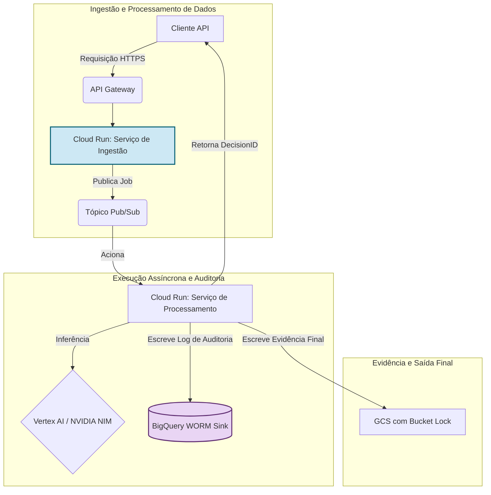

<!-- HERO BANNER -->
<p align="center">
  <a href="https://ibb.co/KpNq85zS">
    
  </a>
</p>

<h1 align="center">FoundLab Veritas: Infraestrutura de Confiança Auditável</h1>
<h3 align="center">Transformando risco regulatório em um ativo computacional e defensável.</h3>

<div align="center">
  
  
  
  
  <a href="https://github.com/FoundLab-org/veritas/actions/workflows/simulation_check.yml">
    
  </a>
</div>
<div align="center" style="margin-top: 4px;">
  
  
  
</div>

---

## Índice
- [1. Tese Institucional](#1-tese-institucional)
- [2. Primitivos Arquitetônicos](#2-primitivos-arquitetônicos)
- [3. Arquitetura de Sistema](#3-arquitetura-de-sistema)
- [4. Estudo de Caso Real: O Incidente de SSO da NVIDIA](#4-estudo-de-caso-real-o-incidente-de-sso-da-nvidia)
- [5. Implicações Estratégicas para a NVIDIA](#5-implicações-estratégicas-para-a-nvidia)
- [6. Compliance como Infraestrutura](#6-compliance-como-infraestrutura)
- [7. Dossiê de Due Diligence Técnico](#7-dossiê-de-due-diligence-técnico)
- [8. Licença e Aviso Legal](#8-licença-e-aviso-legal)

---

## 1. Tese Institucional

A tese central da FoundLab é que a solução para o trilema institucional — velocidade de inovação vs. risco sistêmico vs. complexidade regulatória — reside em uma mudança de paradigma: **transformar a confiança, de um resultado operacional, para um componente fundamental e programável da infraestrutura.**

Não construímos aplicações melhores sobre fundações de risco; criamos uma nova fundação que elimina o risco em sua origem. Este repositório é o blueprint e a demonstração ao vivo desta nova categoria: **Infraestrutura de Confiança Auditável como Serviço.**

---

## 2. Primitivos Arquitetônicos

A plataforma é construída sobre três pilares interdependentes, cuja interação sinérgica resolve o trilema estratégico de velocidade, risco e conformidade.

<details>
<summary><strong>Pilar I: Segurança Radical (Zero-Persistence)</strong></summary>

> Este pilar é a implementação prática do princípio de Zero-Trust. Ao determinar que dados sensíveis de clientes **nunca são armazenados em disco**, o paradigma de "persistência zero" erradica fundamentalmente a classe de risco mais comum e perigosa: a violação de dados em repouso. Todo o processamento ocorre exclusivamente em memória volátil, dentro de contêineres efêmeros. Esta não é apenas uma política; é uma imposição arquitetônica que fornece um "Certificado de Destruição" criptográfico para cada transação, alinhando-se aos padrões NIST SP 800-88 Rev. 1 e atendendo diretamente aos princípios de minimização de dados da LGPD.

</details>

<details>
<summary><strong>Pilar II: Auditabilidade Absoluta (Protocolo Veritas)</strong></summary>

> O Protocolo Veritas move o paradigma de auditoria de "confie em nós" para "verifique matematicamente". Para cada ciclo de decisão, o sistema gera uma trilha de auditoria imutável e à prova de violação, selada por uma **cadeia de hashes** criptográfica e associada a um **DecisionID** único. Isso cria uma cadeia de custódia digital verificável para cada ação. O ledger é armazenado em um sink WORM (Write-Once, Read-Many), como o Google BigQuery, protegido por controles rígidos de IAM e Perímetros de Serviço VPC para prevenir a exfiltração de dados. Qualquer tentativa de alterar um registro anterior invalidaria toda a cadeia subsequente, tornando a fraude computacionalmente detectável.

</details>

<details>
<summary><strong>Pilar III: Inteligência Antifrágil</strong></summary>

> A plataforma orquestra múltiplos motores de IA (ex: Google Gemini, NVIDIA NIMs) para automatizar análises complexas. A arquitetura é projetada para ser **antifrágil**:
> - **Orquestração Multi-Engine:** Uma Camada de Abstração de Motores (EAL) roteia dinamicamente as tarefas para o melhor modelo de IA, prevenindo dependência de fornecedor e garantindo resiliência.
> - **Fallback Auditado:** Se um motor primário falha, a EAL aciona automaticamente um secundário, e todo o evento de falha/recuperação é imutavelmente registrado pelo Protocolo Veritas, transformando falhas operacionais em eventos auditáveis.
> - **IA Explicável (XAI) & Flywheel:** Cada decisão orientada por IA é acompanhada por uma `Rationale` legível por humanos. Esse output, combinado com o feedback humano, alimenta um pipeline de MLOps de ciclo fechado (o "IA Flywheel") que retreina e melhora continuamente os modelos, criando uma vantagem competitiva composta em precisão e confiabilidade.

</details>

---

## 3. Arquitetura de Sistema

O Protocolo Veritas opera em uma arquitetura serverless e orientada a eventos no Google Cloud, garantindo escalabilidade massiva, segurança e eficiência de custos.



---

## 4. Estudo de Caso Real: O Incidente de SSO da NVIDIA

Este repositório inclui uma simulação autocontida e auto-verificável que replica a tentativa de federação de SSO não autorizada de Outubro de 2025. Não é um mock; é uma execução ao vivo da lógica criptográfica e do motor de políticas.

### Passo 1: Execute a Especificação

Navegue até o diretório da simulação e execute o script.

```bash
cd infracore_simulation
pip install -r ../requirements.txt
python main.py
```

### Passo 2: Visualize a Prova Criptográfica

O script gera um log criptográfico bruto (`veritas_audit_trail.jsonl`). Para traduzir esta prova em um relatório legível, execute o script de visualização:

```bash
python visualize_trail.py
```
Isso cria um arquivo `audit_report.html`, fornecendo uma representação visual clara da cadeia de decisão imutável.

---

## 5. Implicações Estratégicas para a NVIDIA

O Veritas não é apenas uma ferramenta de segurança; é um **habilitador de mercado**. Ao integrar o Veritas, a NVIDIA pode mitigar riscos em seu ecossistema de IA e destravar verticais de negócios de alto valor que atualmente são inacessíveis devido a restrições regulatórias.

- **Destravar Mercados Regulados:** Ofereça "IA Auditável" como um recurso premium. Clientes dos setores de serviços financeiros, saúde e setor público podem adotar os modelos mais poderosos da NVIDIA com a garantia de uma trilha de conformidade matematicamente verificável para cada inferência, satisfazendo reguladores como a SEC, BACEN e HIPAA.
- **Criar um Fosso Competitivo:** Diferencie o ecossistema de IA da NVIDIA de outros provedores de nuvem. Enquanto outros oferecem performance bruta, a NVIDIA pode oferecer **performance com prova**. Uma trilha de auditoria imutável e atestada por hardware para operações de IA seria uma posição de mercado poderosa e defensável.
- **Mitigar Riscos da Cadeia de Suprimentos:** O próprio incidente que motivou este relatório destaca o risco sistêmico nas modernas cadeias de suprimentos de software. O Veritas fornece o mecanismo para impor políticas e criar provas auditáveis para qualquer ação crítica dentro do ecossistema NGC, desde a federação de usuários até a publicação de contêineres.

---

## 6. Compliance como Infraestrutura

Nossa arquitetura é uma implementação direta de "Compliance-by-Design". Transformamos requisitos regulatórios em controles técnicos testáveis, auditáveis e determinísticos.

| Requisito Regulatório | Solução Arquitetônica | Evidência Verificável |
| :--- | :--- | :--- |
| **LGPD:** Minimização e Exclusão de Dados | **Arquitetura Zero-Persistence:** Processamento em memória efêmera. | "Certificado de Destruição" criptográfico na trilha de auditoria. |
| **BACEN Res. 85/2021:** Rastreabilidade e Auditoria | **Protocolo Veritas:** Ledger imutável com hash-chain. | `DecisionID` permite a reconstrução completa de qualquer evento. |
| **CVM:** Manutenção de Registros e Prova de Diligência | **Protocolo Veritas + IA Explicável (XAI):** Cada decisão inclui um score e uma `Rationale` em linguagem natural. | Trilha de auditoria contém tanto a decisão quanto sua justificativa. |
| **ISO 27001:** Controle de Acesso | **IAM e Menor Privilégio:** Acesso granular baseado em papéis para cada microsserviço. | Arquivos de IaC do Terraform definem e impõem todas as permissões. |

---

## 7. Dossiê de Due Diligence Técnico

Para uma compreensão abrangente do incidente e de nossa arquitetura institucional, compilamos um dossiê completo.

- **[00_EXECUTIVE_SUMMARY.md](./briefing_room/00_EXECUTIVE_SUMMARY.md)**: Um resumo de uma página para liderança (EN/PT).
- **[01_CASE_STUDY_NVIDIA_INCIDENT.md](./briefing_room/01_CASE_STUDY_NVIDIA_INCIDENT.md)**: Uma análise detalhada do incidente de federação.
- **[02_TECHNICAL_WHITEPAPER.md](./briefing_room/02_TECHNICAL_WHITEPAPER.md)**: O whitepaper técnico completo da Plataforma Umbrella.
- **[03_VERITAS_PROTOCOL.md](./briefing_room/03_VERITAS_PROTOCOL.md)**: Um aprofundamento técnico em nossa tecnologia de trilha de auditoria criptográfica.

---

## 8. Licença e Aviso Legal

Este projeto está licenciado sob a Licença MIT. Veja o arquivo [LICENSE](LICENSE) para mais detalhes.

*Aviso Legal: Este repositório contém uma especificação funcional e executável para fins educacionais e de auditoria. A solução comercial está disponível como um serviço gerenciado e escalável.*
