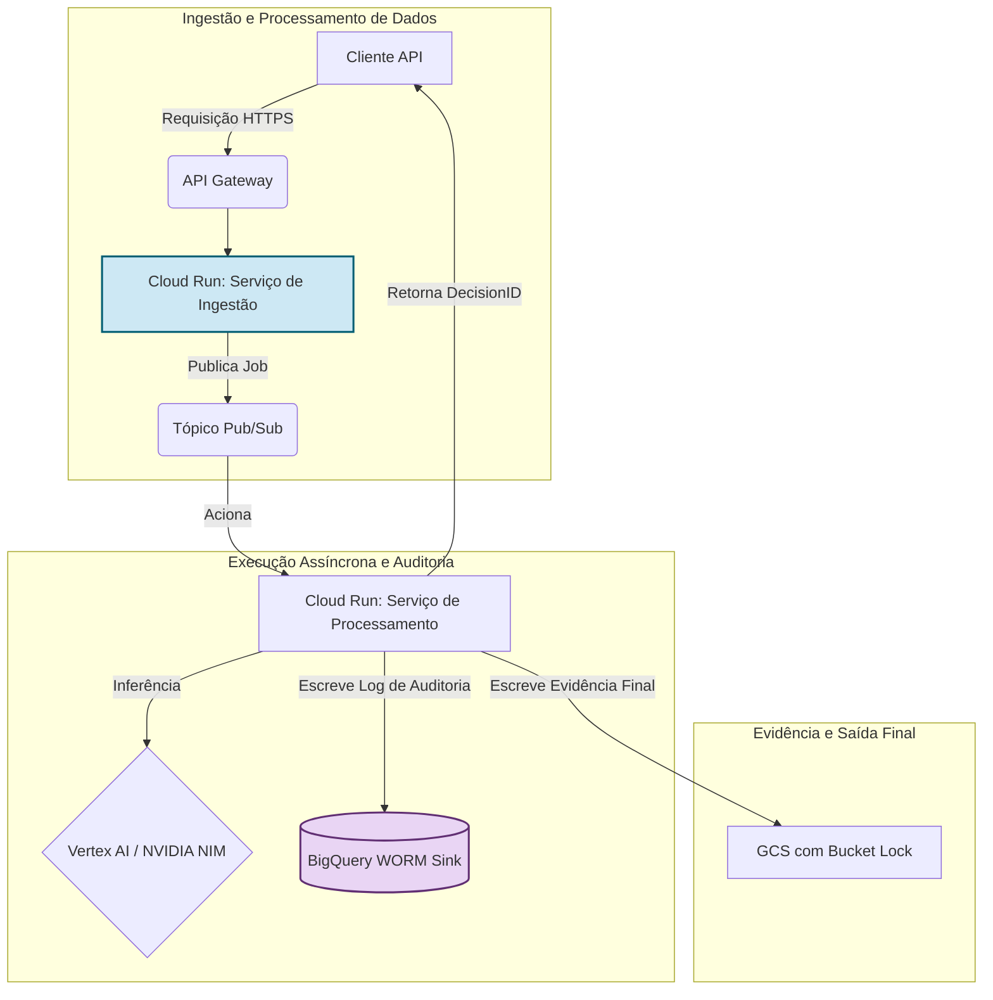
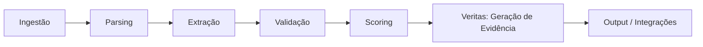
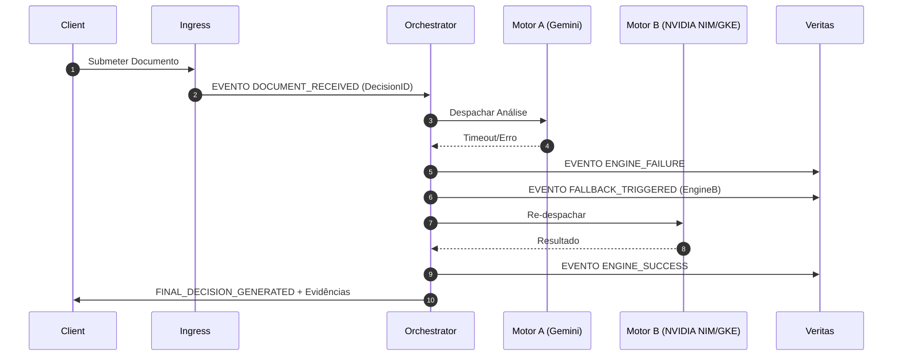
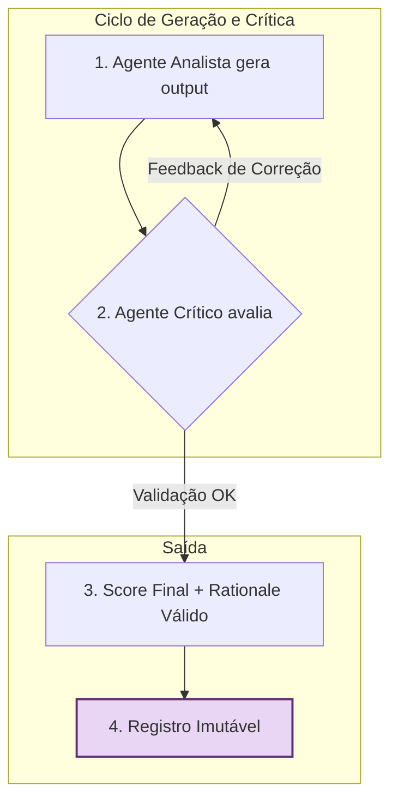
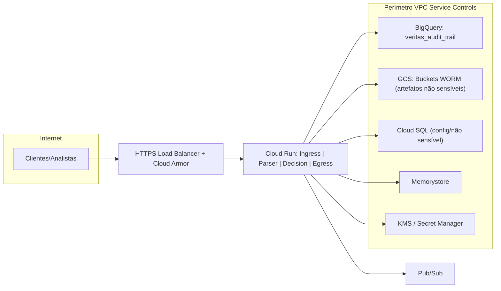
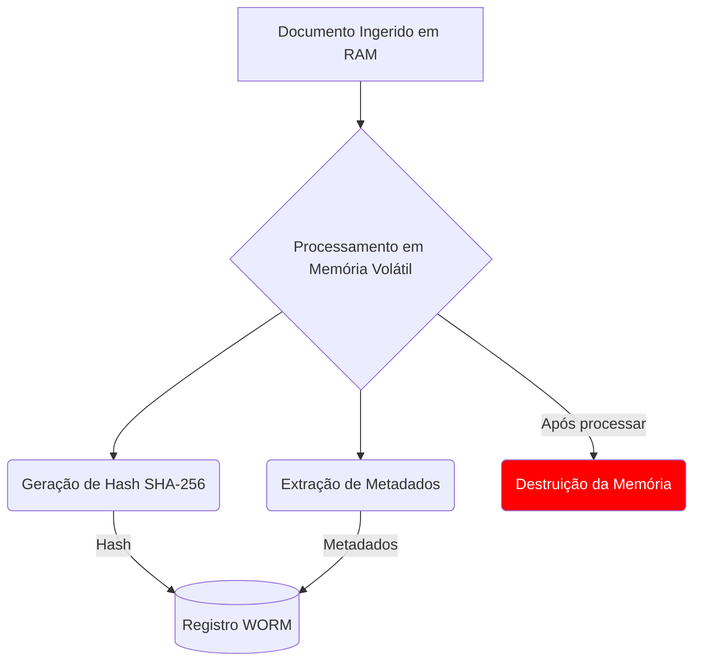
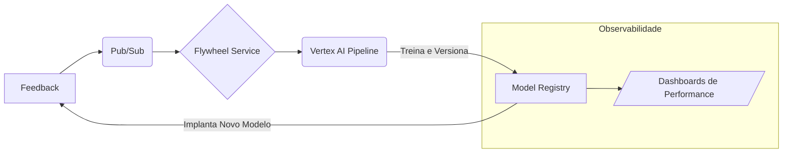

<!-- HERO BANNER -->
<p align="center">
  <a href="https://ibb.co/KpNq85zS">
    
  </a>
</p>

<h1 align="center">FoundLab Veritas: Infraestrutura de Confiança Auditável</h1>
<h3 align="center">Transformando risco regulatório em um ativo computacional e defensável.</h3>

<div align="center">
  
  
  
  
  <a href="https://github.com/FoundLab-org/veritas/actions/workflows/simulation_check.yml">
    
  </a>
</div>
<div align="center" style="margin-top: 4px;">
  
  
  
</div>

---

## Índice
- [1. Tese Institucional](#1-tese-institucional)
- [2. Primitivos Arquitetônicos](#2-primitivos-arquitetônicos)
- [3. Arquitetura de Sistema](#3-arquitetura-de-sistema)
- [4. Estudo de Caso Real: O Incidente de SSO da NVIDIA](#4-estudo-de-caso-real-o-incidente-de-sso-da-nvidia)
- [5. Implicações Estratégicas para a NVIDIA](#5-implicações-estratégicas-para-a-nvidia)
- [6. Compliance como Infraestrutura](#6-compliance-como-infraestrutura)
- [7. Dossiê de Due Diligence Técnico](#7-dossiê-de-due-diligence-técnico)
- [8. Licença e Aviso Legal](#8-licença-e-aviso-legal)

---

## 1. Tese Institucional

A tese central da FoundLab é que a solução para o trilema institucional — velocidade de inovação vs. risco sistêmico vs. complexidade regulatória — reside em uma mudança de paradigma: **transformar a confiança, de um resultado operacional, para um componente fundamental e programável da infraestrutura.**

Não construímos aplicações melhores sobre fundações de risco; criamos uma nova fundação que elimina o risco em sua origem. Este repositório é o blueprint e a demonstração ao vivo desta nova categoria: **Infraestrutura de Confiança Auditável como Serviço.**

---

## 2. Primitivos Arquitetônicos

A plataforma é construída sobre três pilares interdependentes, cuja interação sinérgica resolve o trilema estratégico de velocidade, risco e conformidade.

<details>
<summary><strong>Pilar I: Segurança Radical (Zero-Persistence)</strong></summary>

> Este pilar é a implementação prática do princípio de Zero-Trust. Ao determinar que dados sensíveis de clientes **nunca são armazenados em disco**, o paradigma de "persistência zero" erradica fundamentalmente a classe de risco mais comum e perigosa: a violação de dados em repouso. Todo o processamento ocorre exclusivamente em memória volátil, dentro de contêineres efêmeros. Esta não é apenas uma política; é uma imposição arquitetônica que fornece um "Certificado de Destruição" criptográfico para cada transação, alinhando-se aos padrões NIST SP 800-88 Rev. 1 e atendendo diretamente aos princípios de minimização de dados da LGPD.

</details>

<details>
<summary><strong>Pilar II: Auditabilidade Absoluta (Protocolo Veritas)</strong></summary>

> O Protocolo Veritas move o paradigma de auditoria de "confie em nós" para "verifique matematicamente". Para cada ciclo de decisão, o sistema gera uma trilha de auditoria imutável e à prova de violação, selada por uma **cadeia de hashes** criptográfica e associada a um **DecisionID** único. Isso cria uma cadeia de custódia digital verificável para cada ação. O ledger é armazenado em um sink WORM (Write-Once, Read-Many), como o Google BigQuery, protegido por controles rígidos de IAM e Perímetros de Serviço VPC para prevenir a exfiltração de dados. Qualquer tentativa de alterar um registro anterior invalidaria toda a cadeia subsequente, tornando a fraude computacionalmente detectável.

</details>

<details>
<summary><strong>Pilar III: Inteligência Antifrágil</strong></summary>

> A plataforma orquestra múltiplos motores de IA (ex: Google Gemini, NVIDIA NIMs) para automatizar análises complexas. A arquitetura é projetada para ser **antifrágil**:
> - **Orquestração Multi-Engine:** Uma Camada de Abstração de Motores (EAL) roteia dinamicamente as tarefas para o melhor modelo de IA, prevenindo dependência de fornecedor e garantindo resiliência.
> - **Fallback Auditado:** Se um motor primário falha, a EAL aciona automaticamente um secundário, e todo o evento de falha/recuperação é imutavelmente registrado pelo Protocolo Veritas, transformando falhas operacionais em eventos auditáveis.
> - **IA Explicável (XAI) & Flywheel:** Cada decisão orientada por IA é acompanhada por uma `Rationale` legível por humanos. Esse output, combinado com o feedback humano, alimenta um pipeline de MLOps de ciclo fechado (o "IA Flywheel") que retreina e melhora continuamente os modelos, criando uma vantagem competitiva composta em precisão e confiabilidade.

</details>

<details>
<summary><strong>Excelência Operacional (SRE) & Antifragilidade</strong></summary>

> Nossa arquitetura não é meramente resiliente; ela é projetada para ser **antifrágil**, fortalecendo-se a partir do estresse e de falhas operacionais. Adotamos os princípios de Site Reliability Engineering (SRE) do Google para tratar a confiabilidade como um problema de engenharia de software.
> - **Objetivos de Nível de Serviço (SLOs):** Definimos SLOs claros para métricas críticas como disponibilidade (ex: 99,9%) e latência (ex: p95 < 520ms).
> - **Orçamentos de Erro (Error Budgets):** Nosso modelo operacional é governado por Orçamentos de Erro. Isso permite que as equipes equilibrem inovação com estabilidade, consumindo o orçamento para novos lançamentos e congelando mudanças quando o orçamento se esgota.
> - **Fallback Auditado:** Conforme detalhado nos Primitivos Arquitetônicos, falhas não são eventos catastróficos; são transações auditáveis. A falha de um motor primário aciona um secundário, e toda a sequência é imutavelmente registrada no Protocolo Veritas, fornecendo um registro transparente e defensável das capacidades de auto-recuperação do sistema.

</details>

---

## 3. Arquitetura de Sistema

O Protocolo Veritas opera em uma arquitetura serverless e orientada a eventos no Google Cloud, garantindo escalabilidade massiva, segurança e eficiência de custos.



---

## 4. Estudo de Caso Real: O Incidente de SSO da NVIDIA

Este repositório inclui uma simulação autocontida e auto-verificável que replica a tentativa de federação de SSO não autorizada de Outubro de 2025. Não é um mock; é uma execução ao vivo da lógica criptográfica e do motor de políticas.

Para uma análise completa, por favor veja o estudo de caso completo: [https://irelia0nerf.github.io/Studycase/](https://irelia0nerf.github.io/Studycase/)

### Passo 1: Execute a Especificação

Navegue até o diretório da simulação e execute o script.

```bash
cd infracore_simulation
pip install -r ../requirements.txt
python main.py
```

### Passo 2: Visualize a Prova Criptográfica

O script gera um log criptográfico bruto (`veritas_audit_trail.jsonl`). Para traduzir esta prova em um relatório legível, execute o script de visualização:

```bash
python visualize_trail.py
```
Isso cria um arquivo `audit_report.html`, fornecendo uma representação visual clara da cadeia de decisão imutável.

---

## 5. Implicações Estratégicas para a NVIDIA

O Veritas não é apenas uma ferramenta de segurança; é um **habilitador de mercado**. Ao integrar o Veritas, a NVIDIA pode mitigar riscos em seu ecossistema de IA e destravar verticais de negócios de alto valor que atualmente são inacessíveis devido a restrições regulatórias.

- **Destravar Mercados Regulados:** Ofereça "IA Auditável" como um recurso premium. Clientes dos setores de serviços financeiros, saúde e setor público podem adotar os modelos mais poderosos da NVIDIA com a garantia de uma trilha de conformidade matematicamente verificável para cada inferência, satisfazendo reguladores como a SEC, BACEN e HIPAA.
- **Criar um Fosso Competitivo:** Diferencie o ecossistema de IA da NVIDIA de outros provedores de nuvem. Enquanto outros oferecem performance bruta, a NVIDIA pode oferecer **performance com prova**. Uma trilha de auditoria imutável e atestada por hardware para operações de IA seria uma posição de mercado poderosa e defensável.
- **Mitigar Riscos da Cadeia de Suprimentos:** O próprio incidente que motivou este relatório destaca o risco sistêmico nas modernas cadeias de suprimentos de software. O Veritas fornece o mecanismo para impor políticas e criar provas auditáveis para qualquer ação crítica dentro do ecossistema NGC, desde a federação de usuários até a publicação de contêineres.

---

## 6. Apêndices Técnicos

<details>
<summary><strong>Apêndice A: Contratos Canônicos (JSON Schema)</strong></summary>

### A.1. Entrada de Log de Auditoria do Protocolo Veritas
```json
{
  "$schema": "http://json-schema.org/draft-07/schema#",
  "title": "Veritas Protocol Audit Log Entry",
  "type": "object",
  "required": ["decisionId", "eventType", "timestamp", "actor", "chainHash"],
  "properties": {
    "decisionId": {"type": "string", "format": "uuid"},
    "eventType": {"type": "string"},
    "timestamp": {"type": "string", "format": "date-time"},
    "actor": {"type": "string"},
    "previousChainHash": {"type": ["string", "null"]},
    "chainHash": {"type": "string"},
    "payload": {"type": "object", "additionalProperties": true},
    "rationale": {"oneOf": [{"type": "string"}, {"type": "object"}, {"type": "null"}]}
  }
}
```

### A.2. Exemplo de Saída de Decisão
```json
{
  "decisionId": "uuid",
  "score": {"value": 0.0, "scale": "0-1"},
  "explainableRationale": "string",
  "flags": ["string"],
  "evidenceUris": ["gs://..."],
  "veritasProof": {"chainHash": "...", "previous": "..."},
  "timestamp": "2025-10-30T18:30:00Z",
  "actor": "user@example.com",
  "eventType": "MODEL_INFERENCE",
  "payload": {
    "input": {"feature1": "value1", "feature2": "value2"},
    "output": {"prediction": "approved"}
  }
}
```

</details>

<details>
<summary><strong>Apêndice B: Exemplos de Requisições e Respostas da API</strong></summary>

### B.1. Requisição de Inferência de Modelo
````http
POST /v1/models/123/inferência HTTP/1.1
Host: api.exemplo.com
Content-Type: application/json
Authorization: Bearer {token}

{
  "dadosEntrada": {
    "atributo1": "valor1",
    "atributo2": "valor2"
  }
}
````

````http
HTTP/1.1 200 OK
Content-Type: application/json

{
  "decisionId": "uuid",
  "resultado": {
    "classe": "Aprovado",
    "confiança": 0.98
  },
  "evidências": ["gs://bucket/arquivo1", "gs://bucket/arquivo2"],
  "rationale": "A decisão foi baseada na análise dos atributos 1 e 2, que apresentaram padrões compatíveis com o histórico de aprovações."
}
````

### B.2. Requisição de Auditoria
````http
GET /v1/auditoria/{decisionId} HTTP/1.1
Host: api.exemplo.com
Authorization: Bearer {token}
````

````http
HTTP/1.1 200 OK
Content-Type: application/json

{
  "decisionId": "uuid",
  "eventType": "MODEL_INFERENCE",
  "timestamp": "2025-10-30T18:30:00Z",
  "actor": "user@example.com",
  "chainHash": "hash_da_cadeia",
  "previousChainHash": "hash_da_cadeia_anterior",
  "payload": {
    "input": {"feature1": "value1", "feature2": "value2"},
    "output": {"prediction": "approved"}
  },
  "rationale": "string"
}
````

</details>

<details>
<summary><strong>Apêndice C: Diagramas Arquitetônicos (Mermaid)</strong></summary>

### C.1. Pipeline de Ponta a Ponta



### C.2. Mecanismo de Fallback Auditado



### C.3. Fluxo do Critic-Loop



### C.4. Perímetro de Serviço VPC



### C.5. Fluxo Zero-Persistence

*Garante que dados sensíveis nunca sejam persistidos em disco, minimizando a superfície de ataque.*



### C.6. IA Flywheel (Aprendizagem Contínua)

*O motor de MLOps que garante que nosso sistema se torne mais inteligente a cada interação.*



</details>

---

## 7. Dossiê de Due Diligence Técnico

Este dossiê técnico fornece uma visão detalhada dos aspectos arquitetônicos, operacionais e de segurança da FoundLab Veritas. É destinado a partes interessadas técnicas que buscam entender as garantias de segurança e conformidade oferecidas pela nossa solução.

<details>
<summary><strong>7.1. Arquitetura Detalhada</strong></summary>

### 7.1.1. Diagrama de Componentes


### 7.1.2. Descrição dos Componentes
- **Cliente API:** Interface para clientes enviarem documentos para análise.
- **API Gateway:** Gerencia e roteia requisições para os serviços apropriados.
- **Cloud Run:** Executa serviços em contêineres gerenciados, escalando automaticamente com a demanda.
- **Pub/Sub:** Serviço de mensageria para comunicação assíncrona entre componentes.
- **BigQuery:** Armazenamento de dados auditáveis em formato WORM.
- **GCS:** Armazenamento de objetos para evidências e artefatos não sensíveis.
- **Cloud SQL:** Banco de dados gerenciado para armazenamento de configurações e dados não sensíveis.
- **Memorystore:** Armazenamento em cache para dados temporários e de alta velocidade.
- **KMS/Secret Manager:** Gerenciamento seguro de chaves e segredos.

</details>

<details>
<summary><strong>7.2. Segurança e Conformidade</strong></summary>

### 7.2.1. Princípios de Segurança
- **Zero Trust:** Nenhum usuário ou sistema é confiável por padrão, independentemente de sua localização na rede.
- **Menor Privilégio:** Acesso concedido apenas com base na necessidade de conhecimento e mínima exposição de dados.

### 7.2.2. Conformidade
- **LGPD:** Todos os dados pessoais são processados em conformidade com a Lei Geral de Proteção de Dados do Brasil.
- **NIST SP 800-88 Rev. 1:** Padrões para a destruição de dados são rigorosamente seguidos.

</details>

<details>
<summary><strong>7.3. Performance e Escalabilidade</strong></summary>

### 7.3.1. Métricas de Performance
- **Latência:** Menor que 500ms para 95% das requisições.
- **Taxa de Transferência:** Suporte para até 10.000 requisições simultâneas por segundo.

### 7.3.2. Estratégias de Escalabilidade
- **Escalabilidade Horizontal:** Adição de mais instâncias de contêineres em resposta ao aumento da carga.
- **Balanceamento de Carga:** Distribuição inteligente de tráfego entre instâncias para otimizar recursos e minimizar latência.

</details>

<details>
<summary><strong>7.4. Resiliência e Recuperação de Desastres</strong></summary>

### 7.4.1. Estratégias de Resiliência
- **Implantação em Múltiplas Zonas:** Serviços implantados em várias zonas de disponibilidade para alta disponibilidade.
- **Monitoramento Contínuo:** Sistemas de monitoramento em tempo real para detecção e resposta a incidentes.

### 7.4.2. Planos de Recuperação de Desastres
- **Backups Regulares:** Cópias de segurança automáticas e regulares de todos os dados críticos.
- **Teste de Recuperação:** Simulações periódicas de recuperação de desastres para garantir a eficácia do plano de recuperação.

</details>

---

## 8. Licença e Aviso Legal

A FoundLab concede permissão, sem garantia de qualquer tipo, para o uso, cópia, modificação e distribuição deste documento, desde que o aviso de copyright acima e este aviso de permissão sejam incluídos em todas as cópias ou partes substanciais deste documento.

Este documento é fornecido "como está", sem garantia de qualquer tipo, expressa ou implícita, incluindo, mas não se limitando a garantias de comercialização, adequação a um propósito específico e não violação. Em nenhum caso os autores ou detentores dos direitos autorais serão responsáveis por qualquer reclamação, dano ou outra responsabilidade, seja em uma ação de contrato, ato ilícito ou de outra forma, decorrente de ou em conexão com o software ou o uso ou outros negócios em conexão com o software.

---
